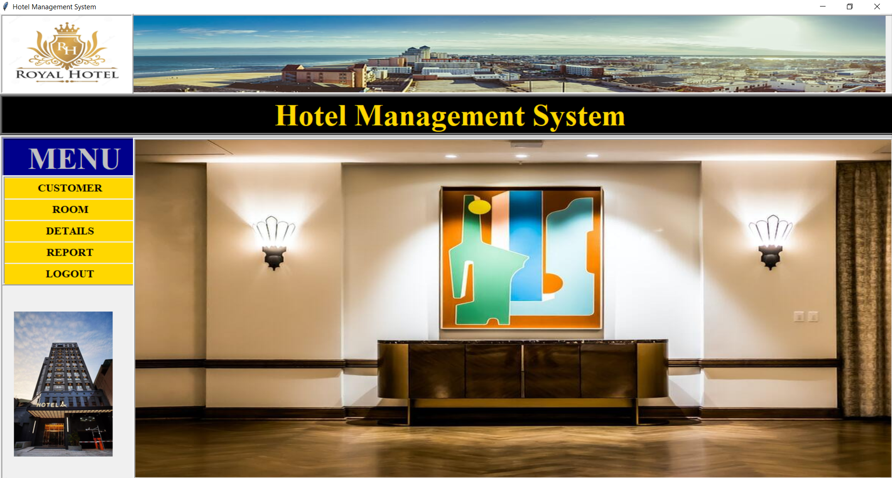
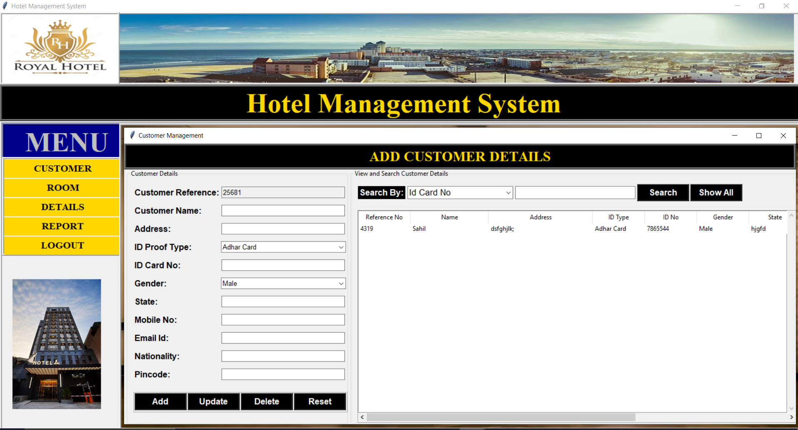

# Hotel Management System

A desktop application for managing hotel operations built with Python and Tkinter.

## 🚀 Features
- **Customer Management**: Add, update, search and delete customer records
- **Room Booking**: Book rooms and track availability
- **Billing & Payments**: Generate bills and manage payments
- **Staff Management**: Track employee details and duties
- **Reports**: Generate occupancy and revenue reports

## 📸 Screenshots
<div align="center">
    
    
</div>

## ⚙️ Setup
1. Prerequisites:
    - Python 3.8+
    - MySQL Database

2. Installation:
    ```bash
    # Clone repository
    git clone https://github.com/devendra1007/Hotel.git
    cd hotel-management

    # Create virtual environment (optional)
    python -m venv venv
    source venv/bin/activate  # Linux/Mac
    venv\Scripts\activate     # Windows

    # Install dependencies
    pip install -r requirements.txt

    # Setup database
    mysql -u root -p < database/setup.sql

    # Run application
    python main.py
    ```


## 📌 Usage
### Customer Management
1. Click CUSTOMER button
2. Fill customer details
3. Click Add

### Room Booking
1. Navigate to ROOM section
2. Select available room
3. Enter customer details
4. Set dates
5. Click Book

### Reporting
1. Click REPORT
2. Select report type
3. Set date range
4. Generate


## 🛠️ Tech Stack
- Python + Tkinter
- MySQL
- PIL


## 📄 License
MIT License

## 📞 Contact
- Email: dataversaiesolutions@gmail.com
- LinkedIn: @sahilthorat

<div align="center">
<p>Made with ❤️ by Sahil Thorat</p>
<p>⭐ Star this repository if you found it useful! ⭐</p>
</div>